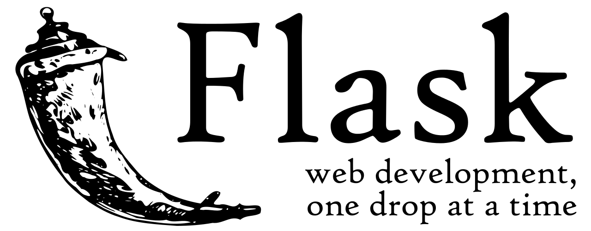

# **Microservice app using Flask and Nginx servers**

This is just a simple microservice based Flask and nginx application developed with the purpose of serving as a custom Docker image in order to play with `Kubernetes`. 

<p align="center">
  
  
</p>

The source code of this app is very simple, it is just a simple application that return to the client the information of the host and also has a method that make a simple get request to a nginx microservice in order to get the nginx home page and return it to the user.

The source code of the can be found in the [k8s_flask_app.py](./k8s_flask_app.py) file and it's content is the following:

```python 
import os
import requests
from flask import Flask, jsonify

app = Flask("k8s-flask-nginx")
@app.route('/', )
def get_k8s_pod():
    pod_info = os.uname()

    return jsonify(pod_info)

@app.route("/nginx")
def call_nginx():
    url = 'http://nginx'
    response = requests.get(url)

    result = {
        "status_code": response.status_code,
        "response": response.text
    }

    return jsonify(result)
```
## Getting Started
In order to deploy this application into your Kubernetes cluster, you just have to use the yaml configuration files, this files are [k8s-flask-nginx.yaml](./k8s-flask-nginx.yaml) and [nginx.yaml](./nginx.yaml), with these files you can create a deployment and a service for each microservice of the application, in this case for the flask web server and the nginx server into your Kubernetes cluster using the apply command of the kubectl tool.

In order to create the kubernetes objects related to the flask web server, you just have to use to following command:

```bash 
kubectl apply -f k8s-flask-nginx.yaml
```

Then to create the kubernetes objects related to the nginx server, you just have to use to following command:

```bash 
kubectl apply -f nginx.yaml
```