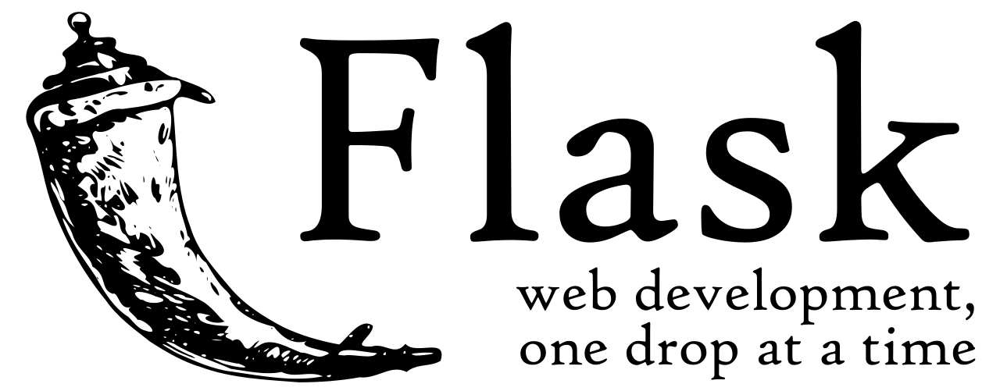

# K8S Flask App

This is just a simple Flask application developed with the purpose of serving as a custom Docker image in order to play with `Kubernetes`. 

<p align="center">
  
</p>

The source code of this app is very simple, it is just a simple application that return to the client the information of the host.

The source code of the can be found in the [k8s_flask_app.py](./k8s_flask_app.py) file and it's content is the following:

```python 
import os
from flask import Flask, jsonify

app = Flask("k8s-flask")
@app.route('/')
def get_k8s_pod():
    pod_info = os.uname()

    return jsonify(pod_info)
```
## Getting Started
In order to deploy this application into your Kubernetes cluster, you just have to use the yaml configuration files, this files are [deployment.yaml](./deployment.yaml) and [service.yaml](./service.yaml), with these files you can create a deployment and a service (LoadBalancer) into your Kubernetes cluster using the apply command of the kubectl tool.

In order to create a deployment of this app, you just have to use to following command:

```bash 
kubectl apply -f deployment.yaml
```

Then to create the LoadBalancer to be able to connect to the application from the localhost, you have to use the following command:

```bash 
kubectl apply -f service.yaml
```