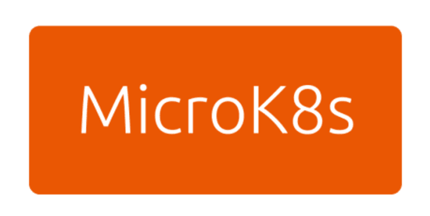

# Setup Kube6ml on Windows

In order to run the scripts of this project on windows, it is necessary to be able to run [Kubernetes](https://kubernetes.io) locally, to do so there are some options available online, but in this document will be explained how to setup Kubernetes on your local computer using [Microk8s](https://microk8s.io), which is basically a tool that allows us to deploy a lite version of Kubernetes.

<p align="center">
  
  
</p>

Microk8s can be setup on windows in some ways, in this document will be used the Windows Subsystem Linux (wsl 2) using an Ubuntu distribution, this allows us to install and configure microk8s easily. 

## Prerequisites
In order to install Microk8s into your local machine using the wsl 2 of course your need to have a computer with the minimum requirements to enable this tool, and these are the followings:

- You must be running Windows 10 version 2004 and higher (Build 19041 and higher) or Windows 11.

- A Windows 10 or 11 machine with at least 8 GB of RAM and 40 GB storage.

## Getting Started
The [Canonical](https://canonical.com) company which is the maintainer of Ubuntu has a nice blog explaining how to make the installation step by step, to see this blog refer to the following pages:

- [Kubernetes on Windows with MicroK8s and WSL 2](https://ubuntu.com/blog/kubernetes-on-windows-with-microk8s-and-wsl-2)
- [WSL2+Microk8s: the power of multinodes - Instructions](https://wsl.dev/wsl2-microk8s/)

Once you finish the installation of Microk8s, you are gonna be able to run a lite version of Kubernetes locally in you computer.

## Start with Kubernetes
In order to start playing around with kubernetes using microk8s, you first have to start the microk8s cluster using the following command in wsl terminal:

```bash 
microk8s start
```

Once this command is executed, the kubernetes cluster will be deployed and running in your computer, now you can use it like any kubernetes infrastructure, for example you can see the dashboard.

To see the kubernetes-dashboard, first at all you need to enable some addons of microk8s using the following command:

```bash
microk8s enable dashboard
```

This command allows us to enable the dashboard addon of microk8s, then you need to start the dashboard local server using the following command:

```bash
microk8s dashboard-proxy
```

With this, the kubernetes dashboard is up and running, the output of the last command prints out a token, it's important that you take this token and save it somewhere because this is the authentication method to sing-in into the kubernetes dashboard. Now the last thing that you have to do is map the ports of the wsl to the ports of your localhost, this is done using the following command:

```bash
microk8s kubectl -n kube-system port-forward --address 0.0.0.0 service/kubernetes-dashboard <local_port>:443
```

Now everything is setup and ready to start play around with our kubernetes dashboard, just open your browser and go to `https://localhost:<local_port>`.

